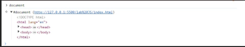

# JavaScript 1 
 
JavaScript jest głównie interpretowanym, dynamicznie typowanym obiektowym językiem programowania, którego składnia wywodzi się z języka C, C++, Java (ogólnie języków C-podobnych). Aczkolwiek warto tutaj od razu dodać, że czasami nie warto przenosić na język JavaScript przyzwyczajeń z innych języków programowania, nawet jeśli składnia wydaje się bardzo podobna/taka sama. Formalnie standaryzowaniem tego języka zajmuje się organizacja ECMA, która wydaje standard języka ECMAScript. JavaScript jest rozumiany jako konkretna implementacja tego standardu. Język ten wprowadzono głównie, aby umożliwić z jednej stronie generowanie dynamicznych treści po stronie klienta (przeglądarki), a z drugiej, aby wprowadzić w większym stopniu interaktywność stron internetowych. Co ważne w trakcie rozwoju tego języka, w pewnym momencie dość mocno zaktualizowano składnię języka (jest to wersja oznaczona jako ES6). W pierwszym okresie rozwoju tego języka uważano, że poza zawodowymi programistami, będzie on wykorzystywany przez amatorów, hobbystów i inne osoby niezawodowo zajmujące się programowaniem. Powodowało to dość dużą elastyczność języka i "odporność" na błędy (w tym składniowe) popełniane przez programistów. Na marginesie warto z kolei zauważyć, że obecnie język JavaScript jest językiem ogólnego przeznaczenia, który wyszedł poza domenę jedynie pisania interaktywnych stron internetowych. Odrębne funkcjonalności (tj. niekoniecznie dostępne z poziomu przeglądarki) posiada node.js (pisanie backendu w języku JavaScript), electron (pisanie webowych aplikacji desktopowych), czy rozwiązania do tworzenia hybrydowych aplikacji mobilnych (np. ionic, react native). 

Warto zaznaczyć, że często stosuje się zamiast pełnej nazwy JavaScript lekko kolokwialny skrót JS, który może być stosowany w niniejszej instrukcji. 

## 1. Wykonywanie skryptów 
Najprostszym sposobem na pisanie programów w JavaScript jest wykorzystanie konsoli przeglądarki (przy czym otwiera się tutaj tryb interpretacji kodu linia po linii): 

 <br>
  
Alternatywą jest umieszczenie skryptu wewnątrz znacznika script: 

```html
<!DOCTYPE html> 
<html lang="en"> 
<head> 
    <meta charset="UTF-8"> 
    <meta name="viewport" content="width=device-width, initial-scale=1.0"> 
    <title>Document</title> 
</head> 
<body>     <script> 
        var a = 1; // deklaracja i inicjalizacja zmiennej a 
        console.log(a); // wypisanie zmiennej w konsoli przeglądarki 
    </script> 
</body> 
</html>
```
Skrypt taki zostanie automatycznie wykonany przez przeglądarkę. 
 <br>
  
W przypadku dłuższych skryptów takie podejście jest raczej nieefektywne i możliwe jest załączenie zewnętrznego skryptu:

```html
<!DOCTYPE html> 
<html lang="en"> 
<head> 
    <meta charset="UTF-8"> 
    <meta name="viewport" content="width=device-width, initial-scale=1.0"> 
    <title>Document</title> 
</head> 
<body> 
    <script src="sample.js"></script> 
</body>
</html>
```
 
## 2. Deklarowanie zmiennych 
W pierwszym okresie rozwoju języka do deklaracji zmiennej używano słowa kluczowego `var`. Obecnie nie zaleca się stosować tej konstrukcji w nowym kodzie, zwłaszcza gdy piszemy klasy nowego typu. Jednak z użyciem tej składni powstało bardzo dużo tzw. legacy code'u i poznanie tej konstrukcji nadal wydaje się konieczne. Warto zwrócić uwagę, że `var` oznacza zmienną dowolnego typu. 

```javascript
var a = 1; 
console.log(a); // wypisanie zmiennej w konsoli przeglądarki
```

Zasadniczo język dopuszcza pominięcie tej deklaracji 

```javascript
a = 1; 
console.log(a); // wypisanie zmiennej w konsoli przeglądarki
```

Język zastosuje tutaj jednak automatycznie konstrukcję równoważną mniej więcej takiej: 

```javascript
var a; // deklaracja zmiennej a a = 1; // inicjalizacja zmiennej a 
console.log(a); // wypisanie zmiennej w konsoli przeglądarki
```

**Nie poleca się jednak pomijania deklaracji zmiennej, jest to zła praktyka.**
W wersji ES6 wprowadzono nowy sposób deklarowania zmiennych za pomocą let i const. 

```javascript
let a = 1; // jest to zmienna mutowalna, jej wartość może ulec zmianie const b = 0; // jest to stała, która jest niemutowalna, nie można zmienić jej wartości 
a	+= 1; // zmienną a można modyfikować console.log(a) 
b	+= 2; // tutaj nastąpi błąd wykonania, nie można modyfikować stałej b
```

W przeciwieństwie do stosowania var, tutaj kwestia pominięcia deklaracji stałej/zmiennej jest bardziej skomplikowana. Interpreter JavaScript nie jest w stanie domyśleć się czy chcemy zastosować stałą czy zmienną mutowalną i co do zasady nie stosuje się w ogóle takiej konstrukcji.  

Warto 	od razu 	zapoznać 	się 	ze 	zjawiskiem 	tzw. 	hoistingu  [link](https://developer.mozilla.org/en-US/docs/Glossary/Hoisting). 
Nieznajomość tego pojęcia (i brak zakładania, że może się ono pojawić) może prowadzić do nieoczekiwanych błędów.  

## 3. Obiekty w JavaScript. 
Język JavaScript posiada dość unikalny system obiektowy. Większość języków obiektowych jest oparta o klasy (ang. class-based object model), na bazie których tworzymy obiekty. JS jest natomiast oparty o prototypy (ang. prototype-based object model). W pewnym skrócie w JS tworzymy obiekty, z których możemy utworzyć kolejne obiekty (w tym rozszerzające pierwowzór), bez potrzeby pisania klas. Każdy obiekt w JS posiada jakiś prototyp (może to być choćby null, ale raczej język stosuje taką konstrukcję wewnętrznie, tzn. samodzielnie pisane obiekty nie powinny mieć takiego prototypu).   
Najprostszy sposób na utworzenie obiektu w JS to wykorzystanie ang. object literal: 

```javascript
const obj = {};
```

Pomimo zwięzłości tej konstrukcji utworzony obiekt jak widzimy poniżej posiada metody: 

<br>

Można zadać sobie pytanie skąd one się wzięły? Pomimo że nie napisano tego wprost, obiekt obj ma ustawiony jako prototyp obiekt Object. Jest to właściwie 	złożony 	typ 	danych 	(więcej 	tutaj 
[link](https://developer.mozilla.org/en-US/docs/Web/JavaScript/Reference/Global_Objects/Object) ). Object sam posiada prototyp ustawiony jako `null`: 

 <br>
  
Zadeklarujmy jednak bardziej "użyteczny" obiekt (również wykorzystując object literal): 
```javascript
const person = {name: null, printIntroduction: function() {return `I am ${this.name}`}}
```

 <br>
  
Tym razem poza prototypem Object obiekt posiada właściwość (property) name i metodę `printIntroduction`. 

Możliwe jest teraz zdefiniowanie nowego obiektu, którego prototypem będzie person (warto zwrócić uwagę, że poniżej po prostu nadpisano wartość właściwości rodzica, ale jednocześnie w rodzicu pozostała ona nienaruszona):

```javascript
const mark = Object.create(person); mark.name = 'Mark'; 
```
 <br>
 
Zatem obiekt mark posiada jako prototyp obiekt person, który posiada jako prototyp obiekt Object (który sam posiada prototyp null). Potencjalnie w języku JS ten ciąg dziedziczenia prototypów może być bardzo złożony i nazywa się łańcuchem prototypów (prototype chain). 
Więcej tutaj: [link](https://developer.mozilla.org/en-US/docs/Web/JavaScript/Inheritance_and_the_prototype_chain) i [link](https://ui.dev/beginners-guide-to-javascript-prototype)
Inną powszechnie wykorzystywaną konstrukcją jest poniższa (ang. constructor function): 

```javascript
function Person(name) {
           this.name = name; 
           this.printIntroduction = function() {return `I am ${this.name}`}; 
        } 
susan = new Person('Susan');
```

 <br>
   
Język JavaScript pozwala również "złożyć" sobie obiekt z innych obiektów. 
```javascript
const HoursEmployee = { 
            computeHourlyPayment(hours) {                 return hours * this.hourlyRate; 
            }         } 
const FullTimeEmployee = {             computeMonthlySalary() {                 return this.salary; 
            } 
} 
```

```javascript
function FullTimeEmployeeWithAdditionalHourlyPayment(salary, hourlyRate) {       return {salary, hourlyRate, 
                ...FullTimeEmployee, 	...HoursEmployee, computeOverallPayment(additionalHours) { 
                return this.computeHourlyPayment(additionalHours) + this.computeMonthlySalary(); 
                } 
            }         } 
const f = new FullTimeEmployeeWithAdditionalHourlyPayment(5000, 40); 
console.log(f.computeOverallPayment(10));
```

Obiekt `FullTimeEmployeeWithAdditionalHourlyPayment` ma na celu reprezentowanie pracownika, który jednocześnie pracuje na etat, jak i tzw. akord (np. w formie nadgodzin, ale potencjalnie sprawa może być bardziej złożona, np. pracownik czasowo zastępuje innego pracownika na jego stanowisku i otrzymuje za to poza swoją zwykłą pensją dodatkowe wynagrodzenie). Obiekt został utworzony jako złożenie obiektu `HoursEmployee` i `FullTimeEmployee` oraz właściwości salary i hourlyRate. 
Alternatywnie możliwa jest również konstrukcja zaprezentowana poniżej: 
```javascript
const hourlyPaymenter = (state) => ({     computeHourlyPayment(hours) {         return hours * state.hourlyRate; 
    } 
});
 
const fullTimePaymenter = (state) => ({       computeMonthlySalary() {             return state.salary; 
      } 
});          
function HourlyEmployee2(hourlyRate) {    let x = {hourlyRate: hourlyRate} 
   return Object.assign(x, hourlyPaymenter(x)); } 
 
function FullTimeEmployee2(salary) {     let x = {salary: salary}; 
    return Object.assign(x, fullTimePaymenter(x)); } 
 
function FullTimeEmployeeWithAdditionalHourlyPayment2(salary, hourlyRate) { 
     let x = {salary, hourlyRate}; 
 
     let o = Object.assign(x, hourlyPaymenter(x), fullTimePaymenter(x)); 
     o.computeOverallPayment = (additionalHours) => { 
     return o.computeMonthlySalary() + o.computeHourlyPayment(additionalHours); 
 }; 
     return o; 
} 
const he = new HourlyEmployee2(20); console.log(he.computeHourlyPayment(5)); 
 
const fte = new FullTimeEmployee2(5000); console.log(fte.computeMonthlySalary()); 
 
const ftewahp = new FullTimeEmployeeWithAdditionalHourlyPayment2(5000, 20); console.log(ftewahp.computeOverallPayment(20));
```
W ten sposób na bazie dwóch funkcji (które są też obiektami) utworzono kilka docelowych obiektów. Warto zwrócić uwagę, że dodawanie nowych funkcjonalności zwykle jest w ten sposób trywialnie proste i można wielokrotnie wykorzystywać fragmenty kodu, bez tworzenia skomplikowanej hierarchii dziedziczenia klas (wynikowe obiekty są dość luźno ze sobą związane).  
Więcej 	o 	tych 	technikach 	można 	przeczytać 	tutaj: 
[link](https://softchris.github.io/pages/javascript-composition.html#objectcomposition-without-classes) i tutaj: [link](https://ui.dev/javascript-inheritancevs-composition). 
 
Obiektom w JS można w każdej chwili dynamicznie dodać nową właściwość: 
```javascript
susan.newProperty = 'zupełnie nowa właściwość!';
```

Podobnie metodę: 
```javascript
susan.newMethod = function() { return 'Ta metoda została dodana po utworzeniu obiektu!'};
```
Na razie nie będzie jeszcze prezentowane pisanie klas w JS, które oczywiście dodatkowo rozszerza tworzenie obiektów o nową składnię, jednak od razu warto zaznaczyć, że klasy są lukrem syntaktycznym (syntactic sugar) i w rzeczywistości są zamieniane pod spodem na wyrażenia operujące na prototypach i ich łańcuchach!  

## 4. Document Object Model (DOM) 
DOM jest wbudowanym w przeglądarkę internetową interfejsem programistycznym, przeznaczonym do programowego manipulowania dokumentem HTML. Skrypty wykonywane w przeglądarce mają zawsze automatycznie dostępny obiekt document, który jest odwołaniem do korzenia (ang. root element), zawierającym jednak liczne metody, które umożliwiają manipulowanie DOM. 
DOM można rozumieć jako programowe odwzorowanie dokumentu HTML w obiekt w JavaScript. Właściwie istnieje tutaj złożona hierarchia implementowanych interfejsów (interfejs ma w JS inne znaczenie niż w Java, obiekt implementuje dany interfejs, jeżeli posiada wymagane przez niego właściwości i metody). Przykładowo select posiada następujący łańcuch prototypów: 

 <br>
  
Jeśli skrypt ma modyfikować elementy DOM, lepiej umieścić go na końcu sekcji <body> lub użyć zdarzenia DOMContentLoaded, aby upewnić się, że skrypt jest wykonywany po załadowaniu drzewa DOM. To zapewnia, że skrypt będzie mógł operować na istniejących już elementach. Ogólnie skrypty będą wykonywać się w kolejności dodania na stronę i istnieje możliwość, że ich wykonywanie rozpocznie się zanim strona zdąży załadować się w całości. 


## 5. Zdarzenia (eventy) w JS 
Elementy HTML posiadają możliwość dodania im atrybutu(ów), które dowiązują wykonanie konkretnej funkcji w JS w przypadku wystąpienia danego zdarzenia. 
Załóżmy, że mamy zdefiniowany przycisk  
```html
<button id="btn" onclick="handler(event)">przycisk</button>
```
i następnie załączono skrypt (argument musi nazywać się event): 
```javascript
function handler(event) {    console.log(event.target); 
   console.log('Został wciśnięty przycisk');
   event.target.innerText = 'Zmieniono napis';
}
```
Możliwe jest również napisane inline handlera: 
```html
<button onclick="this.innerText = 'zmieniony tekst'">przycisk2</button>
```
Kolejna opcja to napisane handlera bezargumentowego (wtedy jednak nie będzie dostępu do obiektu eventu i trzeba będzie w inny sposób odwoływać się do przycisku, gdyby była taka potrzeba): 
```html
<button id="btn2" onclick="handler2()">przycisk2</button> 
function handler2() { 
    document.getElementById('btn2').innerText = 'zmieniony';
}
```
Innym sposobem na pracę ze zdarzeniami jest programowe dodawanie event listenerów (gdybyśmy zupełnie programowo tworzyli dokument, będzie to być może preferowany sposób): 
 
### [Zadanie 1.](TASK1/index.html) 
Zmienne w języku JavaScript definiujemy za pomocą 3 słów kluczowych: 
-	`let` o nie mogą być ponownie zadeklarowane w danym bloku {} o mogą mieć ponownie przypisaną wartość o nie są dostępne poza blokami {} 
-	`var` o może być pusta (undefined) 
o możemy ponownie przypisywać wartości 
-	const o nie mogą być ponownie zadeklarowane w danym bloku o nie mogą mieć ponownie przypisanej wartości o nie są dostępne poza blokami {} 
[link](https://developer.mozilla.org/pl/docs/Learn/JavaScript/First_steps/Variables) 
JavaScript pozwala na elastyczne przypisywanie różnych typów danych do tych samych zmiennych w trakcie działania programu.
```javascript
let zmienna = 10;  // Zmienna 'zmienna' jest typu number (liczba) console.log(typeof zmienna);  // Wyświetli: number 
 
zmienna = "Tekst";  // Teraz 'zmienna' jest typu string (tekst) console.log(typeof zmienna);  // Wyświetli: string 
 
zmienna = true;  // Teraz 'zmienna' jest typu boolean (wartość logiczna) 
console.log(typeof zmienna);  // Wyświetli: boolean
```

Podstawowe operatory: 

| Operacja          | Operator |
|-------------------|----------|
| przypisania       | = += -= *= /= %= >>= <<= |
| logiczne "LUB"    | \|\|     |
| logiczne "I"      | &&       |
| bitowe "LUB"      | \|       |
| bitowe "XOR"      | ^        |
| bitowe "I"        | &        |
| Porównanie wartości | == !=   |
| Porównanie wartości i typu | === !== |
| relacji           | < <= > >= in instanceof |
| dodawanie/odejmowanie | + -  |
| mnożenie/dzielenie/modulo | * / % |
 
Utwórz zmienne: 
```javascript
a = "3.45" b = 4 c = true d  e = []
```
Wykonaj działania arytmetyczne +, -, *, / na parach zmiennych [a, b] [b,c] [a, c]  
Które z operacji arytmetycznych wykonały się poprawnie? 
Czy kolejność zmiennych przy działaniach na zmiennych różnego typu ma znaczenie? 
Znajdź wytłumaczenie otrzymanych rezultatów w sieci. [link](https://github.com/denysdovhan/wtfjs)
 
### [Zadanie 2.](TASK2/index.html)
Funkcje można zadeklarować na kilka sposobów. 
Sposób 1: Definicja funkcji 
```javascript
function mojaFunkcja() { 
    // kod funkcji }
```
Sposób 2: Wyrażenie funkcyjne 
Tworzona jest tu funkcja anonimowa (funkcja która nie ma nazwy) i jest przypisywana do stałej mojaFunkcja 
```javascript
const mojaFunkcja = function () { 
    // kod funkcji 
};
```
Sposób 3: Funkcja strzałkowa (Arrow function) - ES6 
```javascript
const mojaFunkcja = () => { 
    // kod funkcji 
};
```
Sposób 4: Konstruktor Function 
```javascript
const mojaFunkcja = new Function('arg1', 'arg2', 'return arg1 + arg2;');
```
 
W JavaScript funkcje są obiektami. To oznacza, że w JavaScript funkcje są instancjami obiektów typu Function który ma dodatkowe cechy, takie jak zdolność do wywoływania i posiadania kontekstu `(this)`. To sprawia, że są bardzo elastyczne i użyteczne zarówno jako bloki kodu, jak i obiekty. 
 
Funkcje jako obiekty: 

Mogą być przypisywane do zmiennych i stałych: 
```javascript
let myFunc = function () {     console.log("Funkcja została wywołana"); };
 
myFunc(); // wywołanie funkcji
```
Mogą być przekazywane jako argumenty do innych funkcji:
```javascript
function execute(func_var) {     func_var(); 
}
execute(function () {     console.log("Wywołana funkcja"); 
}); 
```
Mogą być zwracane przez inne funkcje: 
```javascript
function createFunction() {     return function () {         console.log("Funkcja zwrócona przez inną funkcję");     }; 
} 
```

```javascript
const newFunction = createFunction(); // przypisuje obiekt zwrócony przez funkcje do zmiennej 
newFunction(); // obiekt ten jest funkcją 
```
Mogą posiadać właściwości i metody: 
```javascript
function myFunction() { 
    // kod funkcji 
} 
 
myFunction.nazwa = "Funkcja testowa"; 
console.log(myFunction.nazwa); // Wyświetli "Funkcja testowa" 
```

Są instancjami obiektu typu Function: 
```javascript
console.log(typeof myFunction); // Wyświetli "function" console.log(myFunction instanceof Function); // Zwróci true 
 ```
Aby utworzyć funkcję, która przyjmuje nieskończenie wiele parametrów używamy operatora … (rest parameter) 

```javascript
function przyklad(...params) {     console.log(params); 
} przyklad(1, 2, 3, 4, 5, 6, 7, 8, 9, 10);
```
Przekazane jako parametry funkcji liczby od 1 do 10 są przechowywane w tablicy co można zobaczyć w konsoli po uruchomieniu przykładu. 
 
W pliku `zadanie2.js` napisz funkcję arithemticMean która przyjmuje dowolną liczbę parametrów (liczb całkowitych) z których zwracana jest średnia arytmetyczna. 


### [Zadanie 3.](TASK3/index.html)
Załaduj następujący dokument index.html: 

```html
<!DOCTYPE html> 
<html lang="en"> 
<head> 
    <meta charset="UTF-8"> 
    <meta name="viewport" content="width=device-width, initial-scale=1.0"> 
    <title>Document</title> 
</head> 
<body> 
    <h1>Nagłówek</h1> 
    <p>Akapit</p> 
</body> 
</html>
```
Następnie włącz narzędzia deweloperskie w przeglądarce i wpisz: 
`document`
 Efekt powinien być taki: 

 <br>
  
Następnie wpisz kolejno instrukcje i obserwuj co zostanie zwrócone przez konsolę: 
```javascript
document.body document.all
document.getElementsByTagName('h1')
document.getElementsByTagName('h1')[0]
document.getElementsByTagName('h1')[0].innerHTML
document.getElementsByTagName('h1')[0].innerText
document.getElementsByTagName('h1')[0].attributes
document.location document.children
document.children[0].children
document.children[0].children[1].innerHTML
document.children[0].children[1].innerText 
document.parentElement
document.body.parentElement
```

Poza możliwością jedynie podglądu elementów, możliwa jest ich edycja, która będzie odwzorowana w przeglądarce natychmiast.  
```javascript
document.getElementsByTagName('p')[0].innerHTML = 'Akapit 2'
```
Ponadto możliwe jest programowe tworzenie nowych elementów i dodanie ich do dokumentu: 
```javascript
let newP = document.createElement('p'); newP.innerText = 'Programowo utworzony akapit'; document.body.append(newP);
```

[link](https://developer.mozilla.org/en-US/docs/Web/API/Document/createElement) 
 
Poniżej pokazano przykład, w którym tablice, zawierającą obiekty JSON przekształcono w dynamicznie wygenerowaną tablicę HTML. 
[link](https://developer.mozilla.org/en-US/docs/Web/JavaScript/Reference/Statements/for)

```javascript
const exchangeRate = [{"currency":"dolar amerykański","code":"USD","mid":3.9432}, 
                              {"currency":"dolar australijski","code":"AUD","mid":2.6897},                               {"currency":"dolar Hongkongu","code":"HKD","mid":0.5046}, 
                              {"currency":"dolar kanadyjski","code":"CAD","mid":2.9752}, 
                              {"currency":"dolar nowozelandzki","code":"NZD","mid":2.4884},                               {"currency":"dolar singapurski","code":"SGD","mid":2.9809}]; 
 
        const HTMLTable = document.createElement('table'); 
 
        const header = document.createElement('tr');         const currency = document.createElement('th');         currency.innerText = 'Waluta'; 
        const currencyCode = document.createElement('th'); 
        currencyCode.innerText = 'Kod waluty'; 
        const meanExchangeRate = document.createElement('th');         meanExchangeRate.innerText = 'Kurs średni'; 
 
        header.appendChild(currency);         header.appendChild(currencyCode);         header.appendChild(meanExchangeRate); 
 
        HTMLTable.appendChild(header); 
 
 
        for (let curr of exchangeRate) { 
            const row = document.createElement('tr');             const currency = document.createElement('td'); 
            currency.innerText = curr.currency; 
            const currencyCode = document.createElement('td');             currencyCode.innerText = curr.code; 
            const meanExchangeRate = document.createElement('td');             meanExchangeRate.innerText = curr.mid;             row.append(currency);             row.append(currencyCode);             row.append(meanExchangeRate); 
 
            HTMLTable.appendChild(row); 
        } 
document.body.append(HTMLTable);
```
 
Możliwe jest programowa zmiana wartości właściwości stylów CSS danego elementu(ów). Tutaj sprawiono, że tabela posiada dość klasyczne obramowanie. Jednak od razu warto zwrócić uwagę na fakt, że żeby to uzyskać była potrzeba wykorzystania dwóch pętli: 
```javascript
HTMLTable.style.borderCollapse = 'collapse';         for (let child of HTMLTable.children) {             child.style.border = '1px solid black';             for (let grandchild of child.children) { 
                grandchild.style.border = '1px solid black'; 
            } 
        }
```
Co ważne w rzeczywistości dodamy każdemu elementowi inline style. 

Alternatywą jest programowe dodanie samego stylu (który jest przecież atrybutem HTML): 
```javascript
const HTMLTable2 = HTMLTable.cloneNode(true); // tworzymy kopię elementu zanim 
potem zmodyfikujemy mu style, true oznacza, że kopiujemy element z potomkami 
 
 
HTMLTable.style.borderCollapse = 'collapse';         for (let child of HTMLTable.children) {             child.style.border = '1px solid black';             for (let grandchild of child.children) { 
                grandchild.style.border = '1px solid black'; 
            } 
        } 
 
HTMLTable2.setAttribute('class', 'my-table'); 
 
document.body.append(HTMLTable); document.body.append(HTMLTable2); 
.my-table { 
            border-collapse: collapse; 
        } 
 
 .my-table * { 
            border: 1px solid black;  }
```
Jest to lepsze rozwiązanie w przypadku, gdy chcemy w ten sposób ostylować dużą liczbę elementów, jak i upraszcza zdecydowanie skrypt. 
Na podstawie przykładów napisz program, który wygeneruje programowo tabelę, na bazie następującej tablicy w JavaScript: 
```javascript
const data = [ 
    ['Imię', 'Nazwisko', 'Wiek'], 
    ['John', 'Doe', 30], 
    ['Alice', 'Smith', 28], 
    ['Bob', 'Brown', 35] ];
```
Następnie przekształć powstały kod w funkcję, która będzie w stanie wygenerować tabelę dla tablicy o dowolnym rozmiarze. Funkcja powinna przyjmować jako parametr informacje czy tablica ma nagłówki i założyć, że wtedy pierwszy element tablicy jest nagłówkiem. 
 

### [Zadanie 4.](TASK4/index.html)
Zapoznaj się z poniższymi linkami: Zdarzenia elementów html (event listener) [link](https://developer.mozilla.org/en-US/docs/Web/API/Element/click_event) CSS Object Model [link](https://developer.mozilla.org/en-US/docs/Web/API/CSS_Object_Model) Zmiana właściwości dla elementu html 
[link](https://developer.mozilla.org/en-US/docs/Web/API/CSSStyleDeclaration/setProperty)
 
W pliku zadanie4.html Utwórz kalkulator opłacalności zakupu pizzy. Na podstawie wprowadzonych przez użytkownika danych: cena, średnica dla małej i dużej pizzy, program zaznacza kolorem zielonym który zakup w przeliczeniu `cena/cm2` jest bardziej opłacalny. 
 

### [Zadanie 5.](TASK5/index.html)
BOM (Browser Object Model) to część interfejsu JavaScriptu, która umożliwia interakcję z przeglądarką. Oto kilka kluczowych właściwości i metod BOM: 

•	window: Główne okno przeglądarki, reprezentujące globalne środowisko przeglądarki. Jest to obiekt (podobnie jak document).

•	window.document: Odwołuje się do aktualnego dokumentu w oknie przeglądarki. 

•	window.innerWidth i window.innerHeight: Zwracają szerokość i wysokość widocznego obszaru okna przeglądarki. 

•	window.location: Udostępnia informacje o aktualnym adresie URL dokumentu i umożliwia jego manipulację. 

•	window.navigator: Zapewnia informacje o przeglądarce użytkownika, takie jak nazwa, wersja i platforma. 

•	window.alert(): Wyświetla okno dialogowe z komunikatem dla użytkownika. 

•	window.localStorage: przechowuje dane trwale w przeglądarce, pozostające nawet po zamknięciu przeglądarki. Te dane mogą być używane na różnych sesjach i urządzeniach użytkownika. 

•	window.sessionStorage: przechowuje dane sesji dla określonej karty lub okna przeglądarki. Dane te są usuwane po zamknięciu karty lub przeglądarki. 

•	window.console: obiekt wbudowany w przeglądarkę, który umożliwia dostęp do konsoli deweloperskiej. Pozwala programistom na wyświetlanie informacji, ostrzeżeń, błędów oraz debugowanie kodu JavaScript za pomocą metod takich jak log, warn, error, debug, itp. 

•	window.onload: to zdarzenie wywoływane, gdy cała zawartość strony została w pełni załadowana, włącznie z elementami HTML, styli CSS, obrazami, skryptami itp. Jest to moment, w którym wszystkie zasoby strony są gotowe do interakcji i wykorzystania przez skrypty JavaScript. 
 
 
Utwórz stoper, który po zamknięciu okna przeglądarki będzie kontynuował odliczanie w miejscu, w którym skończył. 

Skrypt powinien zaczynać działanie dopiero gdy wszystkie elementy zostaną załadowane: 

[link](https://developer.mozilla.org/en-US/docs/Web/API/Window/load_event)

Do przechowania czasu wykorzystaj localStorage: 

[link](https://developer.mozilla.org/en-US/docs/Web/API/Window/localStorage)

Funkcja setInterval() będzie wywoływać wskazany fragment kodu co x milisekund, można wykorzystać ją do aktualizacji liczby sekund: 

[link](https://developer.mozilla.org/en-US/docs/Web/API/setInterval)
 
