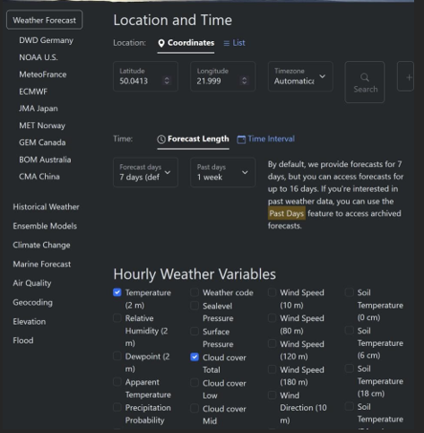
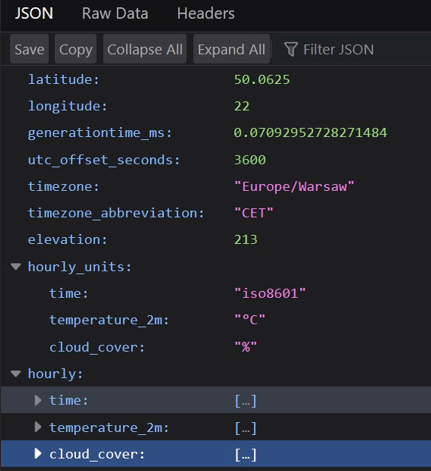

# JavaScript 2 - Zapisywanie stanu aplikacji
 
JSON a JavaScript to ściśle powiązane pojęcia w świecie programowania. JSON (JavaScript Object Notation) jest formatem danych wywodzącym się z języka JavaScript, opartym na składni obiektów w tym języku. Jest to sposób reprezentacji danych w formie czytelnej zarówno dla ludzi, jak i maszyn. 

Składnia JSON jest bardzo zbliżona do składni obiektów i tablic w języku JavaScript, co czyni format łatwym w zrozumieniu dla programistów pracujących w JS. JavaScript wykorzystuje metody takie jak JSON.parse() do przetwarzania danych JSON na obiekty JS oraz JSON.stringify() do konwersji obiektów JavaScript na format JSON. 

[link](https://developer.mozilla.org/en-US/docs/Web/JavaScript/Reference/Global_Objects/JSON)

Dane w formacie JSON są powszechnie używane w aplikacjach internetowych jako sposób przesyłania danych między serwerem a przeglądarką. Ponadto, JSON znalazł szerokie zastosowanie w przechowywaniu danych w bazach danych NoSQL, w konfiguracjach aplikacji oraz jako format wymiany danych między różnymi systemami i platformami. 
Chociaż JSON ma swoje korzenie w języku JavaScript, stał się on uniwersalnym formatem danych stosowanym również w innych językach programowania. Jest to efektywny sposób przechowywania i przetwarzania danych, który zyskał popularność dzięki swojej prostocie, elastyczności i czytelności. Poniżej link do specyfikacji: 

[link](https://www.json.org/json-en.html)

### Zasady tworzenia plików JSON: 
•	Obiekty: Pary klucz-wartość są zapisywane w nawiasach klamrowych {}, gdzie klucz jest ciągiem znaków w cudzysłowiu, a wartość jest dowolnym obsługiwanym typem danych (liczba, ciąg znaków, obiekt, tablica, wartość logiczna lub null), oddzielone dwukropkiem. 

•	Tablice: Zapisywane są w nawiasach kwadratowych [] i zawierają wartości oddzielone przecinkami, które mogą być dowolnymi obsługiwanymi typami danych, w tym innymi obiektami lub tablicami. 

•	Ciągi znaków: Tekst jest zapisywany w cudzysłowach " ". Mogą to być pojedyncze słowa, zdania lub sekwencje znaków. 

•	Liczby: 	Mogą 	być 	zapisane 	jako 	liczby 	całkowite, zmiennoprzecinkowe, dodatnie lub ujemne. 

•	Wartości logiczne: Możliwe wartości to true lub false, reprezentujące prawdę lub fałsz. 

•	Wartość null: Reprezentuje brak wartości i jest zapisywana jako null. 

•	Przecinki: Elementy w obiektach i tablicach są oddzielane przecinkami, z wyjątkiem ostatniego elementu, który nie ma przecinka na końcu. 

•	Formatowanie: JSON ignoruje białe znaki poza tekstem w cudzysłowach, ale nadmiarowe białe znaki (np. spacje, tabulatory, nowe linie) mogą być używane do poprawienia czytelności. 

•	Brak komentarzy: JSON nie obsługuje komentarzy. Nie powinno się ich używać w plikach JSON, ponieważ mogą one powodować błędy składniowe. 

•	Unikalność kluczy: Klucze w obiektach JSON muszą być unikalne. 

### Poniżej przykładowy plik w formacie JSON: 
```json
{
    "osoba": {

        "imie": "Anna",
        "nazwisko": "Kowalska",
        "wiek": 30,
        "adres": {
            "ulica": "Kwiatowa", "numer": 10,
                "miasto": "Warszawa"
        }

        ,
        "telefon": ["123-456-789",
        "987-654-321"],
        "aktywny": true,
        "znizka": null
    }

    ,
    "produkty": [ {
        "nazwa": "Koszula",
            "rozmiar": "M",
            "cena": 49.99,
            "dostepny": true
    }

    ,
        {
        "nazwa": "Spodnie",
            "rozmiar": "L",
            "cena": 79.99,
            "dostepny": false
    }

    ]
}

```
Konwersja JSON na JSObject i dostęp do pól obiektu 
```javascript
// Przykładowy JSON const jsonString = '{ 
    "name": "John", 
    "age": 30, 
    "city": "New York" 
}'; 
 
// Konwersja JSON-a na obiekt const jsonObject = JSON.parse(jsonString); 
 
// Dostęp do pól obiektu console.log("Imię: " + jsonObject.name);
// Wyświetli: Imię: John console.log("Wiek: " + jsonObject.age);
// Wyświetli: Wiek: 30 console.log("Miasto: " + jsonObject.city);
// Wyświetli: Miasto: New York
```
Cookies, Local Storage i Session Storage to mechanizmy przechowywania danych w przeglądarce internetowej. Każdy z nich ma swoje zastosowanie w zależności od potrzeb aplikacji, czasu przechowywania danych i specyfiki danych, które mają być przechowywane. 

## Cookies: 
•	Cookies są małymi plikami przechowywanymi w przeglądarce internetowej użytkownika. 

•	Wykorzystywane są do przechowywania danych, takich jak preferencje użytkownika, dane sesji lub informacje o nawigacji. 

•	Mogą przechowywać do około 4KB danych. 

•	Mogą mieć ustalony czas wygaśnięcia (czasowa) lub być trwałe (pozostają nawet po zamknięciu przeglądarki). 

•	HttpOnly flag - to flaga, która może być ustawiona w pliku cookie, uniemożliwiając dostęp do pliku cookie z poziomu skryptów JavaScript. Zapobiega to atakom typu XSS (Cross-Site Scripting), gdzie nieautoryzowane skrypty próbują uzyskać dostęp do plików cookie użytkownika. 

[link](https://developer.mozilla.org/en-US/docs/Web/API/Document/cookie?retiredLocale=pl)
```javascript
// Ciasteczko o nazwie "user" i wartości "John Doe" z datą ważności za 30 dni, dla konkretnej domeny "example.com"
const expirationDate=new Date(Date.now() + 30 * 24 * 60 * 60 * 1000).toUTCString();
// Data wygaśnięcia za 30 dni
document.cookie="user=John Doe; expires=" + expirationDate + "; domain=example.com; path=/";

// Ciasteczko o nazwie " darkMode" i wartości "true" z datą wygaśnięcia za 365 dni, dla domeny "anotherdomain.com"
const anotherExpirationDate=new Date(Date.now() + 365 * 24 * 60 * 60 * 1000).toUTCString(); // Data wygaśnięcia za 365 dni
document.cookie="darkMode=true; expires=" + anotherExpirationDate + "; domain=anotherdomain.com; path=/";
```
## Local Storage: 

•	To interfejs w przeglądarce internetowej, który pozwala aplikacji na przechowywanie danych w przeglądarce użytkownika. 

•	Głównie służy do trwałego przechowywania danych w przeglądarce, które pozostają nawet po zamknięciu przeglądarki. 

•	Może przechowywać do około 5MB danych. 

•	Dane przechowywane są na dłużej i nie mają ustalonego czasu wygaśnięcia, chyba że zostaną ręcznie usunięte lub wyczyszczone. 

[link](https://developer.mozilla.org/en-US/docs/Web/API/Window/localStorage)
```javascript
// Zapisanie danych w localStorage localStorage.setItem('userName', 'JohnDoe'); localStorage.setItem('userAge', '25'); 
 
// Pobranie danych z localStorage const name = localStorage.getItem('userName'); const age = localStorage.getItem('userAge'); console.log(`Nazwa użytkownika: ${name}, Wiek: ${age}`);  
// Usunięcie danych z localStorage localStorage.removeItem('userName'); 
 
// Sprawdzenie ilości danych w localStorage const dataCount = localStorage.length; console.log(`Liczba zapisanych danych w localStorage: ${dataCount}`);  
// Wyczyszczenie wszystkich danych w localStorage localStorage.clear();
```
## Session Storage: 

•	Podobnie jak Local Storage, to interfejs w przeglądarce służący do przechowywania danych, ale dane są skojarzone z określoną sesją. 

•	Dane przechowywane w Session Storage są ważne tylko podczas trwania określonej sesji, a po jej zamknięciu dane są usuwane. 

•	Ma podobny limit do Local Storage (około 5MB). 

•	Dane są przechowywane tylko do momentu zamknięcia sesji (zamknięcia okna/kaarty przeglądarki). 

[link](https://developer.mozilla.org/en-US/docs/Web/API/Window/sessionStorage)

SessionStorage ma API takie jak session storage. 
```javascript
// Zapis danych do sessionStorage sessionStorage.setItem('userName', 'JohnDoe'); sessionStorage.setItem('userAge', '25'); 
 
// Pobranie danych z sessionStorage const name = sessionStorage.getItem('userName'); const age = sessionStorage.getItem('userAge'); 
console.log(`Nazwa użytkownika: ${name}, Wiek: ${age}`);  
// Usunięcie danych z sessionStorage sessionStorage.removeItem('userName'); 
 
// Sprawdzenie liczby zapisanych danych w sessionStorage const dataCount = sessionStorage.length; console.log(`Liczba zapisanych danych w sessionStorage: ${dataCount}`);  
// Wyczyszczenie wszystkich danych z sessionStorage sessionStorage.clear();
```
 
REST API (Representational State Transfer Application Programming Interface) to architektura programistyczna, która definiuje zbiór zasad dla komunikacji między aplikacjami internetowymi. REST jest stylem projektowania interfejsów API, który wykorzystuje standardowe protokoły sieciowe, takie jak HTTP, URI i JSON, do umożliwienia komunikacji między klientami a serwerami. 

### 1.	Architektura oparta na zasobach (Resources): 

•	REST traktuje dane jako zasoby, które są reprezentowane za pomocą URI (Uniform Resource Identifier). 

•	Każdy zasób ma swój unikalny identyfikator URI, np. /users, /products/123. 

### 2.	Protokoły i metody HTTP: 

•	Wykorzystuje standardowe metody HTTP, takie jak GET, POST, PUT, DELETE, PATCH, aby wykonywać operacje na zasobach. 

•	Metody te odzwierciedlają operacje CRUD (Create, Read, Update, Delete) wykonywane na zasobach. 

### 3.	Bezstanowość (Statelessness): 

•	REST jest bezstanowy, co oznacza, że każde zapytanie do serwera jest niezależne i nie przechowuje stanu po zakończeniu. 

•	Każde zapytanie zawiera wystarczające informacje, aby serwer mógł je zrozumieć i przetworzyć. 

### 4.	Format danych: 

•	REST API często używa formatów danych, takich jak JSON (JavaScript Object Notation) lub XML (Extensible Markup Language) do reprezentacji zasobów. 

•	JSON jest powszechniejszym formatem z powodu swojej czytelności i łatwości obsługi przez przeglądarki. 

### 5.	Jednolity interfejs: 

•	REST API zapewnia jednolity interfejs między klientami a serwerami, co ułatwia zrozumienie i używanie API przez różne aplikacje. 

Powyższe zasady będą przydatne podczas implementacji REST API. Na chwilę obecną warto zapamiętać, że metoda GET protokołu HTTP służy do wysłania zapytania do REST API w celu uzyskania zasobu pod danym adresem URL. 

Starszym interfejsem umożliwiającym wysyłanie zapytań był XHR: [link](https://developer.mozilla.org/en-US/docs/Web/API/XMLHttpRequest?retiredLocale=pl)

Obecnie wykorzystuje się fetch API: [link](https://developer.mozilla.org/en-US/docs/Web/API/Fetch_API)
 
Przykładem darmowego API niewymagającego uwierzytelniania w postaci klucza jest [link](https://open-meteo.com/en/docs)

W dokumentacji znajduje się formularz, w którym możliwe jest utworzenie linku do interesujących nas zasobów: 

 <br>
  <br>
  
Innym szerzej stosowanym przykładem dokumentacji jest ta podobna do [link](https://aviationweather.gov/data/api/)
 
Przykład zapytania do witryny open-meteo.com o dane na temat temperatury i zachmurzenia w ciągu 7 dni wstecz i 7 dni po dzisiejszym dniu. 
```javascript
// Adres URL z danymi do prognozy pogody 
const weatherForecastURL='https://api.open-
meteo.com/v1/forecast?latitude=50.0413&longitude=21.999&hourly=temperature_2 m,
cloud_cover&timezone=auto&past_days=7'; 


// Wykorzystanie fetch do pobrania danych fetch(weatherForecastURL) 
.then(response=> {

        // Sprawdzenie, czy odpowiedź ma status ok (kod 200)
        if ( !response.ok) {
            throw new Error('Network response was not ok.');
        }

        return response.json(); // Parsowanie odpowiedzi do formatu JSON 
    }

).then(data=> {
        // Obsługa danych z odpowiedzi
        console.log('Odebrane dane:', data);
        // Tutaj można wykonać operacje na danych pogodowych 
    }

).catch(error=> {
        // Obsługa błędów
        console.error('Wystąpił błąd:', error);
    }

);
```
Wywołanie requestu zwróci dane w formacie JSON w poniższej postaci, gdzie w tablicach time, temperature_2m cloud_cover są przechowywane dane na temat czasu temperatury i zachmurzenia w kolejnych godzinach: 

 <br>
  
Canvas oferuje interfejs programistyczny, który umożliwia renderowanie grafiki w czasie rzeczywistym w przeglądarce internetowej. Jest często stosowany w projektowaniu stron internetowych, narzędziach do tworzenia grafiki, grach online oraz wszędzie tam, gdzie dynamiczna grafika jest kluczowa dla interaktywności i wizualizacji. 

[link](https://developer.mozilla.org/en-US/docs/Web/API/Canvas_API)

### Poniższy przykład tworzy trzy linie w canvas: 
```html
<!DOCTYPE html>
<html lang="en">

<head>
    <meta charset="UTF-8">
    <meta name="viewport" content="width=device-width, initial-scale=1.0">
    <title>Document</title>
</head>

<body>
    <canvas id="myCanvas" width="400" height="200" style="border:1px solid #000;"></canvas>

    <script>
        // Pobranie elementu Canvas         const canvas = document.getElementById('myCanvas');         const ctx = canvas.getContext('2d'); 

        // Rysowanie linii         ctx.beginPath();         ctx.moveTo(50, 50); // Początek pierwszej linii (x=50, y=50)         ctx.lineTo(200, 50); // Koniec pierwszej linii (x=200, y=50)         ctx.moveTo(50, 100); // Początek drugiej linii (x=50, y=100)         ctx.lineTo(200, 100); // Koniec drugiej linii (x=200, y=100)         ctx.moveTo(50, 150); // Początek trzeciej linii (x=50, y=150)         ctx.lineTo(200, 100); // Koniec trzeciej linii (x=200, y=150)         ctx.stroke(); // Wyrysowanie linii 

    </script>
</body>

</html>
```
Więcej przykładów z rysowaniem kształtów: 
[link](https://developer.mozilla.org/en-US/docs/Web/API/Canvas_API/Tutorial/Drawing_shapes)
 
## [Zadanie 1.](LAB10/TASK1)
Stwórz formularz, który będzie zapisywał wprowadzone dane w localStorage na bieżąco. 
Kroki do wykonania: 

•	Stwórz rozbudowany formularz HTML z wieloma polami na dane osobowe i kontaktowe np. imię, nazwisko, adres, email, wiek. 

•	Wykorzystaj zdarzenia wprowadzania danych, aby na bieżąco zapisywać dane do localStorage. 
```html
<!DOCTYPE html>
<html lang="en">

<head>
    <meta charset="UTF-8">
    <meta name="viewport" content="width=device-width, initial-scale=1.0">
    <title>Document</title>
</head>

<body>
    <form>
        <input id="pole_form" type="text">
    </form>
    <script>
        let pole_form =
            document.getElementById("pole_form").addEventListener("keyup", pole_form_method);

        function pole_form_method(e) {
            // Wyświetlenie wartości pola formularza w konsoli przez e.target który odnosi się do elementu, na którym wystąpiło zdarzenie             console.log(e.target.value); 
            // Odczytanie wartości z kontekstu wystąpienia zdarzenia za pomocą słówka this.             console.log(this.value); 
        }

    </script>
</body>

</html>
```

•	[link](https://developer.mozilla.org/en-US/docs/Web/API/HTMLElement/change_event)

•	Sprawdź przy ładowaniu strony, czy dane są zapisane w localStorage. 

•	Wypełnij pola formularza zapisanymi danymi (jeśli są dostępne). 

### Dodatkowe uwagi: 
•	Upewnij się, że dane są zapisywane w localStorage w miarę wprowadzania. 

•	Zweryfikuj, czy dane są odczytywane i wypełniają pola formularza po ponownym załadowaniu strony. 
 
## [Zadanie 2.](LAB10/TASK2)
Stwórz aplikację, która pobierze dane dotyczące temperatury na najbliższe 7 dni z API open-meteo.com i wyświetli je w tabelce, gdzie kolor tekstu będzie odzwierciedlał wartość temperatury. 
Kroki do wykonania: 

•	Wykorzystaj API open-meteo.com do pobrania prognozy temperatury na najbliższe 7 dni. 

•	Stwórz tabelkę HTML, która będzie prezentować daty i prognozowane temperatury. 

•	Określ kolor tekstu modyfikując style w zależności od wartości temperatury (np. zimne kolory dla niskich temperatur, ciepłe kolory dla wysokich temperatur). 

•	Wyświetlcie 	tabelę 	z 	odpowiednimi 	kolorami 	tekstu, odzwierciedlającymi wartości temperatury. 

### Dodatkowe uwagi: 

•	Sprawdź, czy dane są pobierane i wyświetlane poprawnie. 

•	Upewnij się, że kolor tekstu w tabelce odzwierciedla wartość temperatury zgodnie z założeniami. 

## [Zadanie 3.](LAB10/TASK3)
Stwórz wykres temperatury na podstawie wcześniej pobranych danych z API open-meteo.com przy użyciu elementu Canvas. 

### Kroki do wykonania: 

•	Przygotujcie element Canvas, który będzie służył do rysowania wykresu temperatury. 

•	Na podstawie wcześniej pobranych danych, stwórzcie wykres liniowy reprezentujący 	temperaturę 	na 	kolejne 	dni. 	
Wykorzystaj dokumentację API w celu odnalezienia potrzebnych funkcji - [link](https://developer.mozilla.org/en-US/docs/Web/API/Canvas_API/Tutorial/Drawing_shapes)

•	Dostosujcie skalę wykresu, aby była czytelna i adekwatnie odwzorowywała zmiany temperatury. 

•	Dodajcie odpowiednie oznaczenia osi oraz tytuły wykresu. 

### Dodatkowe uwagi: 

•	Upewnijcie się, że wykres poprawnie odzwierciedla zmiany temperatury na kolejne dni. 

•	Sprawdźcie czy osie wykresu są czytelne i czy zawierają odpowiednie oznaczenia. 
